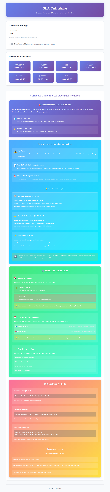
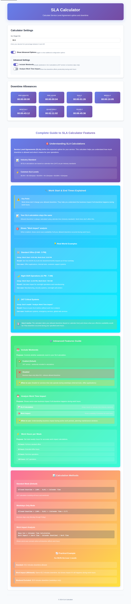
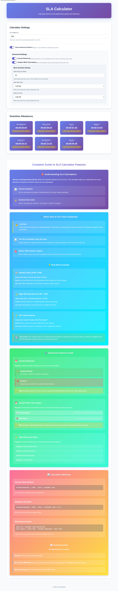

# SLA-Rechner Benutzerhandbuch

**Version 1.0** | **Sprache: Deutsch**

## Inhaltsverzeichnis

1. [Einführung](#einführung)
2. [Erste Schritte](#erste-schritte)
3. [Übersicht der Hauptoberfläche](#übersicht-der-hauptoberfläche)
4. [Rechnereinstellungen](#rechnereinstellungen)
5. [Erweiterte Optionen](#erweiterte-optionen)
6. [Ergebnisse verstehen](#ergebnisse-verstehen)
7. [Praktische Beispiele](#praktische-beispiele)
8. [Fehlerbehebung](#fehlerbehebung)

---

## Einführung

Willkommen beim SLA-Rechner! Dieses Tool hilft Ihnen, **Service Level Agreement (SLA)** Betriebszeit- und Ausfallzeitmetriken zu berechnen. Ob Sie kritische Infrastruktur verwalten, Wartungsfenster planen oder Servicevereinbarungen festlegen – dieser Rechner liefert präzise Messungen für Ihre Verfügbarkeitsanforderungen.

### Was ist ein SLA?

Ein **Service Level Agreement (SLA)** ist eine Vereinbarung zwischen einem Dienstanbieter und einem Kunden, die das erwartete Serviceniveau definiert. SLAs werden typischerweise als Prozentsatz ausgedrückt (z.B. 99,9%, 99,99%), der die minimale Betriebszeitgarantie darstellt.

### Hauptfunktionen

- ✅ Echtzeitberechnungen für mehrere Zeiträume
- ✅ Erweiterte Konfigurationsoptionen (Wochenenden, Geschäftszeiten)
- ✅ Arbeitszeitauswirkungsanalyse
- ✅ URL-Parameter-Unterstützung zum Teilen von Konfigurationen
- ✅ Automatische Speicherung von Einstellungen
- ✅ Responsives Design für Desktop und Mobilgeräte

---

## Erste Schritte

### Zugriff auf den Rechner

1. **Öffnen Sie Ihren Webbrowser** (Chrome, Firefox, Safari, Edge)
2. **Navigieren Sie** zur SLA-Rechner-URL oder öffnen Sie `index.html` lokal
3. Der Rechner lädt sofort mit Standardeinstellungen (99,9% SLA)

### Grundlegender Ablauf

1. Geben Sie Ihren gewünschten SLA-Prozentsatz ein
2. Sehen Sie sofortige Ausfallzeitberechnungen für alle Zeiträume
3. Konfigurieren Sie optional erweiterte Einstellungen
4. Überprüfen und teilen Sie die Ergebnisse

---

## Übersicht der Hauptoberfläche



### Oberflächenbereiche

Die Rechneroberfläche besteht aus drei Hauptbereichen:

#### 1. Rechnereinstellungen (Oberer Bereich)
- **SLA-Zieleingabe**: Geben Sie Ihren gewünschten SLA-Prozentsatz ein
- **Erweiterte Optionen Umschalter**: Ein-/Ausblenden zusätzlicher Konfigurationsoptionen

#### 2. Ausfallzeitkontingente (Mittlerer Bereich)
Zeigt zulässige Ausfallzeiten für verschiedene Zeiträume an:
- **Pro Minute**: Zulässige Ausfallzeit in einer Minute
- **Pro Stunde**: Zulässige Ausfallzeit in einer Stunde
- **Täglich**: Zulässige Ausfallzeit pro Tag
- **Wöchentlich**: Zulässige Ausfallzeit pro Woche
- **Monatlich**: Zulässige Ausfallzeit pro Monat (30 Tage)
- **Vierteljährlich**: Zulässige Ausfallzeit pro Quartal (90 Tage)
- **Jährlich**: Zulässige Ausfallzeit pro Jahr (365 Tage)

#### 3. Vollständiger Leitfaden (Unterer Bereich)
Bildungsinhalte, die erklären:
- Wie SLA-Berechnungen funktionieren
- Beschreibungen erweiterter Funktionen
- Beispiele aus der Praxis
- Berechnungsmethoden und Formeln

---

## Rechnereinstellungen

### SLA-Ziel (%)


**Position**: Oben im Abschnitt Rechnereinstellungen

**Beschreibung**: Das primäre Eingabefeld, in dem Sie Ihren gewünschten Service Level Agreement-Prozentsatz eingeben.

**Verwendung**:
1. Klicken Sie auf das Eingabefeld
2. Geben Sie Ihren gewünschten SLA-Prozentsatz ein (z.B. 99,9, 99,95, 99,99)
3. Verwenden Sie Dezimalpunkte für präzise Werte (bis zu zwei Dezimalstellen)
4. Gültiger Bereich: 0 bis 100

**Häufige SLA-Werte**:
- **99,9%** („Drei Neunen") = 8h 45m Ausfallzeit pro Jahr
- **99,95%** = 4h 23m Ausfallzeit pro Jahr
- **99,99%** („Vier Neunen") = 52m 36s Ausfallzeit pro Jahr
- **99,999%** („Fünf Neunen") = 5m 15s Ausfallzeit pro Jahr

**Echtzeit-Updates**: Ergebnisse werden automatisch aktualisiert, während Sie tippen, ohne dass eine Schaltfläche gedrückt werden muss.

**Tipps**:
- Höhere Prozentsätze bedeuten weniger zulässige Ausfallzeit
- Der Industriestandard für Cloud-Services liegt typischerweise bei 99,9% oder höher
- Berücksichtigen Sie die Kritikalität Ihres Dienstes bei der Wahl eines SLA

---

## Erweiterte Optionen

### Zugriff auf erweiterte Optionen



**So öffnen Sie**:
1. Suchen Sie den Umschalter „Erweiterte Optionen anzeigen" im Abschnitt Rechnereinstellungen
2. Klicken Sie auf den Umschalter, um erweiterte Konfigurationsoptionen zu erweitern
3. Klicken Sie erneut, um erweiterte Optionen zu minimieren und auszublenden

### Übersicht der erweiterten Einstellungen

Wenn erweitert, sehen Sie drei Hauptkonfigurationsoptionen:

#### 1. Wochenenden einbeziehen

**Zweck**: Steuert, ob Wochenenden in SLA-Berechnungen einbezogen werden.

**Standardzustand**: ✅ Aktiviert (Angekreuzt)

**Verwendung**:
1. Klicken Sie auf den Umschalter neben „Wochenenden einbeziehen"
2. Grün = Aktiviert (Wochenenden einbezogen)
3. Grau = Deaktiviert (Wochenenden ausgeschlossen)

**Wenn aktiviert (Standard)**:
- Berechnungen verwenden 24/7-Kalenderzeit
- Alle Wochentage sind einbezogen
- Geeignet für kontinuierlich laufende Dienste
- Beispiel: 99,9% jährlich = 8h 45m Ausfallzeit

**Wenn deaktiviert**:
- Berechnungen verwenden nur Wochentage (Montag-Freitag)
- Reduziert zulässige Ausfallzeit proportional
- Geeignet für Dienste nur während Geschäftszeiten
- Beispiel: 99,9% jährlich = 6h 15m Ausfallzeit (nur Wochentage)

**Anwendungsfälle**:
- **Aktivieren für**: Cloud-Services, E-Commerce-Websites, Gesundheitssysteme, 24/7-Support
- **Deaktivieren für**: Büroanwendungen, interne Tools, Geschäftssysteme

---

#### 2. Arbeitszeitauswirkung analysieren



**Zweck**: Zeigt, wie sich Ausfallzeiten auf die Produktivität während festgelegter Arbeitszeiten auswirken.

**Standardzustand**: ❌ Deaktiviert (Nicht angekreuzt)

**Wichtiges Konzept**: 
> ⚠️ **Wichtiger Punkt**: Diese Einstellung ändert NICHT Ihre zulässige Ausfallzeit. Ihre SLA-Berechnung verwendet immer Kalenderzeit (Industriestandard). Diese Funktion zeigt die **Geschäftsauswirkung**, wenn alle Ausfallzeiten während der Arbeitszeit auftreten würden.

**Verwendung**:
1. Klicken Sie auf den Umschalter neben „Arbeitszeitauswirkung analysieren"
2. Wenn aktiviert, erscheinen zusätzliche Arbeitszeitplaneinstellungen unten
3. Konfigurieren Sie Ihre Arbeitszeitplanparameter

**Wenn aktiviert**:
- Ergebnisse zeigen einen zusätzlichen „Arbeitszeitauswirkung"-Prozentsatz
- Zeigt Worst-Case-Verfügbarkeit, wenn Ausfallzeit während Arbeitszeit auftritt
- Nützlich zum Verständnis der Geschäftsauswirkung
- Beeinflusst die Basis-SLA-Berechnung nicht

**Anzeigeformat**:
```
00:00:43:12
Arbeitszeitauswirkung: 99,58% verfügbar
```

**Arbeitszeitauswirkung verstehen**:
- **Basisberechnung**: Verwendet weiterhin 24/7-Kalenderzeit (43,2 Minuten für 99,9% monatlich)
- **Arbeitszeitauswirkung**: Zeigt effektive Verfügbarkeit während Ihrer 40-Stunden-Arbeitswoche, wenn alle Ausfallzeiten während der Arbeitszeit auftreten würden
- **Beispiel**: 43 Minuten Ausfallzeit in einer 40-Stunden-Arbeitswoche = 99,58% Arbeitszeitverfügbarkeit

---

### Arbeitszeitplaneinstellungen

Wenn „Arbeitszeitauswirkung analysieren" aktiviert ist, erscheinen diese zusätzlichen Einstellungen:

#### A. Arbeitsstunden pro Woche

**Zweck**: Definiert die gesamten wöchentlichen Arbeitsstunden für Auswirkungsberechnungen.

**Standardwert**: 40 Stunden

**Bereich**: 1 bis 168 Stunden

**Verwendung**:
1. Klicken Sie auf das Eingabefeld
2. Geben Sie die Gesamtzahl der Arbeitsstunden pro Woche ein
3. Drücken Sie Enter oder klicken Sie außerhalb des Feldes zum Übernehmen

**Häufige Konfigurationen**:
- **40 Stunden**: Standard-Vollzeit-Arbeitswoche (8 Stunden/Tag × 5 Tage)
- **50 Stunden**: Erweiterte Arbeitswoche
- **20 Stunden**: Teilzeitplan
- **168 Stunden**: 24/7-Betrieb (alle Stunden einer Woche)

**Beispielauswirkung**:
Für 99,9% SLA mit 43,2 Minuten zulässiger Ausfallzeit pro Monat:
- **40h/Woche**: 99,58% Arbeitszeitverfügbarkeit
- **50h/Woche**: 99,43% Arbeitszeitverfügbarkeit
- **168h/Woche**: 99,9% (gleich wie Basis-SLA)

---

#### B. Arbeitsbeginn

**Zweck**: Definiert, wann Ihr Team oder Ihre Benutzer jeden Tag mit der Arbeit beginnen.

**Standardwert**: 8:00 Uhr

**Verfügbare Optionen**: 00:00 bis 23:00 Uhr (stündliche Schritte)

**Verwendung**:
1. Klicken Sie auf das Dropdown-Menü
2. Scrollen Sie durch die verfügbaren Zeiten
3. Wählen Sie Ihre Arbeitsbeginnzeit

**Häufige Szenarien**:
- **9:00 Uhr**: Standard-Bürozeiten
- **8:00 Uhr**: Früher Bürobeginn
- **23:00 Uhr**: Nachtschichtbeginn
- **6:00 Uhr**: Frühmorgenbetrieb

**Hinweis**: Diese Einstellung wird nur für Arbeitszeitauswirkungsberechnungen verwendet und ändert Ihre Basis-SLA-Berechnung nicht.

---

#### C. Arbeitsende

**Zweck**: Definiert, wann Ihr Team oder Ihre Benutzer jeden Tag die Arbeit beenden.

**Standardwert**: 18:00 Uhr (6:00 PM)

**Verfügbare Optionen**: 01:00 bis 00:00 Uhr (stündliche Schritte)

**Verwendung**:
1. Klicken Sie auf das Dropdown-Menü
2. Scrollen Sie durch die verfügbaren Zeiten
3. Wählen Sie Ihre Arbeitsendezeit

**Häufige Szenarien**:
- **17:00 Uhr**: Standard-Büroende
- **18:00 Uhr**: Erweiterte Bürozeiten
- **7:00 Uhr**: Nachtschichtende
- **15:00 Uhr**: Früher Schlusszeitplan

**Unterstützung über Mitternacht**: Sie können eine Endezeit vor der Startzeit festlegen, um Nachtschichten anzuzeigen (z.B. Start: 23:00 Uhr, Ende: 7:00 Uhr).

---

## Ergebnisse verstehen

### Layout der Ergebniskarten

Jeder Zeitraum zeigt:
1. **Zeitraumname**: Pro Minute, Pro Stunde, Täglich, Wöchentlich, Monatlich, Vierteljährlich, Jährlich
2. **Ausfallzeitwert**: Formatiert als TT:HH:MM:SS (Tage:Stunden:Minuten:Sekunden)
3. **Arbeitszeitauswirkung** (wenn aktiviert): Prozentsatz der Arbeitszeitverfügbarkeit

### Ausfallzeitwerte lesen

**Format**: `TT:HH:MM:SS`

**Beispiele**:
- `00:00:00:04` = 4 Sekunden
- `00:00:01:26` = 1 Minute und 26 Sekunden
- `00:00:43:12` = 43 Minuten und 12 Sekunden
- `00:08:45:36` = 8 Stunden, 45 Minuten und 36 Sekunden
- `01:02:11:02` = 1 Tag, 2 Stunden, 11 Minuten und 2 Sekunden

### Ergebnisse interpretieren

**99,9% SLA-Beispiel (Standard)**:
- **Jährlich**: 8h 45m zulässige Ausfallzeit über das gesamte Jahr
- **Monatlich**: 43m 12s zulässige Ausfallzeit pro Monat
- **Täglich**: 1m 26s zulässige Ausfallzeit pro Tag
- **Pro Stunde**: 4 Sekunden zulässige Ausfallzeit pro Stunde

**Was das bedeutet**:
Wenn Ihr Dienst mehr Ausfallzeit als angezeigt erfährt, haben Sie Ihre SLA-Verpflichtung für diesen Zeitraum verletzt.

### Arbeitszeitauswirkungsinterpretation

Wenn „Arbeitszeitauswirkung analysieren" aktiviert ist:

**Anzeigebeispiel**:
```
Monatlich
00:00:43:12
Arbeitszeitauswirkung: 99,58% verfügbar
```

**Bedeutung**:
- **Obere Zeile**: 43 Minuten 12 Sekunden zulässige Ausfallzeit (Basis-SLA)
- **Untere Zeile**: Wenn alle 43 Minuten während Ihrer 40-Stunden-Arbeitswoche auftreten würden, hätten Sie 99,58% Verfügbarkeit während der Arbeitszeit

**Anwendungsfälle**:
- Wartung außerhalb der Arbeitszeiten vs. während der Arbeitszeit planen
- Geschäftsauswirkung von Ausfällen verstehen
- Verfügbarkeit in Geschäftsbegriffen an Stakeholder kommunizieren

---

## Praktische Beispiele

### Beispiel 1: Standard-Webanwendung (99,9% SLA)

**Szenario**: Sie betreiben eine SaaS-Anwendung mit 99,9% Betriebszeitverpflichtung.

**Konfiguration**:
1. SLA-Ziel setzen: `99,9`
2. „Wochenenden einbeziehen" aktiviert lassen
3. „Arbeitszeitauswirkung analysieren" nicht aktivieren

**Ergebnisse**:
- **Jährlich**: 8h 45m zulässige Ausfallzeit
- **Monatlich**: 43m zulässige Ausfallzeit
- **Täglich**: 1m 26s zulässige Ausfallzeit

**Planung**:
- Sie können bis zu 8 Stunden 45 Minuten Ausfallzeit pro Jahr haben
- Ideal für monatliche Wartungsfenster von ~30 Minuten
- Tägliche Mikroausfälle sollten unter 90 Sekunden bleiben

---

### Beispiel 2: Büroanwendung mit Geschäftszeitauswirkung

**Szenario**: Internes CRM-System, das während Bürozeiten verwendet wird (9-17 Uhr, Wochentage).

**Konfiguration**:
1. SLA-Ziel setzen: `99,9`
2. „Erweiterte Optionen anzeigen" klicken
3. „Wochenenden einbeziehen" deaktivieren
4. „Arbeitszeitauswirkung analysieren" aktivieren
5. Arbeitsstunden pro Woche setzen: `40`
6. Arbeitsbeginn setzen: `9:00 Uhr`
7. Arbeitsende setzen: `17:00 Uhr`

**Ergebnisse**:
- **Jährlich**: 6h 15m zulässige Ausfallzeit (nur Wochentage)
- **Monatliche Arbeitszeitauswirkung**: 99,58% verfügbar während Arbeitszeiten

**Interpretation**:
- Ihr SLA erlaubt 6h 15m Ausfallzeit nur an Wochentagen
- Wenn alle Ausfallzeiten während der Arbeitszeit auftreten, erleben Benutzer 99,58% Verfügbarkeit
- Planen Sie Wartungen für Abende oder Wochenenden, um Arbeitszeitauswirkung zu minimieren

---

### Beispiel 3: Hochverfügbarkeitssystem (99,99% SLA)

**Szenario**: Kritisches Zahlungsverarbeitungssystem, das vier Neunen Verfügbarkeit erfordert.

**Konfiguration**:
1. SLA-Ziel setzen: `99,99`
2. „Wochenenden einbeziehen" aktiviert lassen
3. „Arbeitszeitauswirkung analysieren" nicht aktivieren

**Ergebnisse**:
- **Jährlich**: 52m 36s zulässige Ausfallzeit
- **Monatlich**: 4m 23s zulässige Ausfallzeit
- **Täglich**: 8,6 Sekunden zulässige Ausfallzeit

**Planung**:
- Sehr enge Verfügbarkeitsanforderungen
- Jährliches Ausfallzeitbudget von weniger als 1 Stunde
- Monatliche Ausfälle müssen unter 5 Minuten liegen
- Erfordert robuste Architektur und schnelle Vorfallreaktion

---

### Beispiel 4: Nachtschichtfertigung

**Szenario**: Fertigungsanlagensysteme, die in Nachtschicht laufen (23-7 Uhr).

**Konfiguration**:
1. SLA-Ziel setzen: `99,95`
2. „Erweiterte Optionen anzeigen" klicken
3. „Wochenenden einbeziehen" aktiviert lassen
4. „Arbeitszeitauswirkung analysieren" aktivieren
5. Arbeitsstunden pro Woche setzen: `40`
6. Arbeitsbeginn setzen: `23:00 Uhr`
7. Arbeitsende setzen: `7:00 Uhr`

**Ergebnisse**:
- **Jährlich**: 4h 23m zulässige Ausfallzeit (24/7-Berechnung)
- **Arbeitszeitauswirkung**: Zeigt Verfügbarkeit während Nachtschichtstunden

**Anwendungsfall**:
- Produktionsauswirkung von Ausfallzeiten während Betriebszeiten verstehen
- Wartung während Tagschicht planen, wenn Produktion gestoppt ist

---

## Fehlerbehebung

### Häufige Probleme

#### Problem: Erweiterte Optionen werden nicht angezeigt

**Symptom**: Klicken auf „Erweiterte Optionen anzeigen" bewirkt nichts.

**Lösung**: 
- Stellen Sie sicher, dass JavaScript in Ihrem Browser aktiviert ist
- Seite aktualisieren (F5 oder Strg+R)
- Versuchen Sie einen anderen Browser
- Browser-Cache leeren

---

#### Problem: Zahlen aktualisieren sich nicht

**Symptom**: Ändern des SLA-Ziels aktualisiert Ergebnisse nicht.

**Lösung**:
- Überprüfen Sie, dass Sie eine gültige Zahl eingeben (0-100)
- Stellen Sie sicher, dass JavaScript aktiviert ist
- Seite aktualisieren
- Browser-Konsole auf Fehler überprüfen (F12 → Konsole-Tab)

---

#### Problem: Arbeitszeitauswirkung wird nicht angezeigt

**Symptom**: „Arbeitszeitauswirkung analysieren" ist aktiviert, aber keine Arbeitszeitauswirkung angezeigt.

**Lösung**:
- Überprüfen Sie, dass der Umschalter „Arbeitszeitauswirkung analysieren" EIN ist (grün)
- Überprüfen Sie, dass Arbeitszeitplaneinstellungen unter dem Umschalter sichtbar sind
- Stellen Sie sicher, dass Arbeitsstunden pro Woche größer als 0 ist
- Überprüfen Sie, dass Arbeitsbeginn und -ende gesetzt sind

---

#### Problem: Einstellungen werden nicht gespeichert

**Symptom**: Konfiguration wird beim Schließen des Browsers zurückgesetzt.

**Lösung**:
- LocalStorage in Browser-Einstellungen aktivieren
- Überprüfen Sie, dass Sie nicht im privaten/Inkognito-Modus sind
- Überprüfen Sie, dass das Browser-Speicherkontingent nicht überschritten ist
- Versuchen Sie einen anderen Browser

---

### Browser-Kompatibilität

**Unterstützte Browser**:
- ✅ Google Chrome (neueste Version)
- ✅ Mozilla Firefox (neueste Version)
- ✅ Safari (neueste Version)
- ✅ Microsoft Edge (neueste Version)
- ✅ Opera (neueste Version)

**Erforderliche Browser-Funktionen**:
- JavaScript aktiviert
- CSS Grid- und Flexbox-Unterstützung
- ES6-JavaScript-Funktionen
- localStorage-API
- URL-API für Parameter-Parsing

---

### Hilfe erhalten

**Fragen oder Probleme?**

1. **Überprüfen Sie dieses Handbuch** für detaillierte Erklärungen
2. **Überprüfen Sie den Abschnitt Vollständiger Leitfaden** auf der Rechnerseite
3. **Überprüfen Sie die Browser-Konsole** auf Fehlermeldungen (F12 → Konsole)
4. **Support kontaktieren** mit spezifischen Fehlerdetails

---

## Tastaturkürzel

- **Tab**: Zwischen Eingabefeldern navigieren
- **Enter**: Änderungen in Eingabefeldern übernehmen
- **Leertaste**: Kontrollkästchenoptionen umschalten, wenn fokussiert
- **Strg/Cmd + R**: Seite aktualisieren

---

## URL-Parameter (Erweitert)

Sie können spezifische Konfigurationen mit URL-Parametern teilen:

**Beispiele**:

```
# Einfache SLA-Voreinstellung
https://ihre-domain.com/?sla=99.95

# Mit aktivierten Geschäftszeiten
https://ihre-domain.com/?sla=99.9&business=true&workHours=40

# Mit ausgeschlossenen Wochenenden
https://ihre-domain.com/?sla=99.99&weekends=false

# Vollständige Konfiguration
https://ihre-domain.com/?sla=99.95&business=true&workHours=50&workStart=8&workEnd=18&weekends=true
```

**Unterstützte Parameter**:
- `sla`: SLA-Prozentsatz (z.B. 99,9, 99,95)
- `business`: Arbeitszeitauswirkung aktivieren (true/false)
- `workHours`: Arbeitsstunden pro Woche (1-168)
- `workStart`: Arbeitsbeginnstunde (0-23)
- `workEnd`: Arbeitsendestunde (0-23)
- `weekends`: Wochenenden einbeziehen (true/false)

---

## Best Practices

### Wahl eines SLA

1. **Servicekritikalität berücksichtigen**: Höheres SLA für kritische Systeme
2. **Kosten vs. Verfügbarkeit abwägen**: Höhere SLAs erfordern mehr Infrastrukturinvestition
3. **Industriestandards**: Recherchieren Sie, was Wettbewerber anbieten
4. **Technische Machbarkeit**: Stellen Sie sicher, dass Ihre Architektur das SLA unterstützen kann

### Verwendung des Rechners

1. **Mit gängigen Werten beginnen**: 99,9% oder 99,95% für die meisten Dienste
2. **Arbeitszeitauswirkung aktivieren** für benutzerorientierte Anwendungen
3. **Wochenenden ausschließen** für reine Geschäftsdienste
4. **Konfigurationen teilen** über URL-Parameter
5. **Jährliche Werte überprüfen** für langfristige Planung

### Wartung planen

1. **Monatliches Kontingent überprüfen**: Wartung innerhalb Ihres Ausfallzeitbudgets planen
2. **Arbeitszeitauswirkungsanalyse verwenden**: Nach Möglichkeit außerhalb der Arbeitszeit planen
3. **Tatsächliche Ausfallzeit verfolgen**: Mit SLA-Verpflichtungen vergleichen
4. **Proaktiv kommunizieren**: Benutzer vor geplanter Wartung warnen

---

## Anhang: SLA-Referenztabelle

| SLA % | Jährliche Ausfallzeit | Monatliche Ausfallzeit | Tägliche Ausfallzeit | Häufige Anwendungsfälle |
|-------|----------------------|------------------------|---------------------|------------------------|
| 90% | 36T 12h | 3T 0h | 2h 24m | Entwicklungs-/Testumgebungen |
| 95% | 18T 6h | 1T 12h | 1h 12m | Interne Tools |
| 99% | 3T 15h 36m | 7h 18m | 14m 24s | Basis-Webdienste |
| 99,5% | 1T 19h 48m | 3h 39m | 7m 12s | Standard-Webanwendungen |
| 99,9% | 8h 45m 36s | 43m 12s | 1m 26s | Geschäftskritische Dienste |
| 99,95% | 4h 22m 48s | 21m 36s | 43s | Hochverfügbarkeitsdienste |
| 99,99% | 52m 34s | 4m 23s | 8,6s | Missionskritische Systeme |
| 99,999% | 5m 15s | 26s | 0,86s | Ultra-Hochverfügbarkeitssysteme |

---

**Dokumentversion**: 1.0  
**Zuletzt aktualisiert**: 2024  
**Sprache**: Deutsch

---

Für andere Sprachen:
- [Englisches Handbuch (English)](manual.md)
- [Französisches Handbuch (Français)](manual.fr.md)
