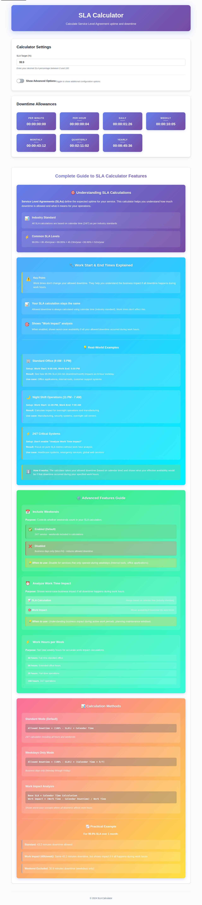
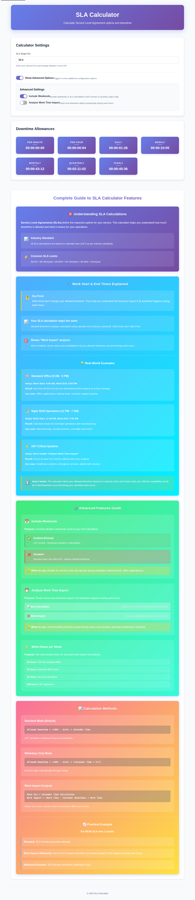
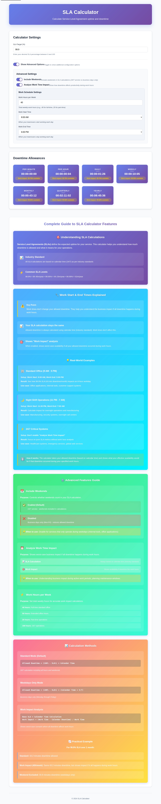

# SLA Calculator User Manual

**Version 1.0** | **Language: English**

## Table of Contents

1. [Introduction](#introduction)
2. [Getting Started](#getting-started)
3. [Main Interface Overview](#main-interface-overview)
4. [Calculator Settings](#calculator-settings)
5. [Advanced Options](#advanced-options)
6. [Understanding the Results](#understanding-the-results)
7. [Practical Examples](#practical-examples)
8. [Troubleshooting](#troubleshooting)

---

## Introduction

Welcome to the SLA Calculator! This tool helps you calculate **Service Level Agreement (SLA)** uptime and downtime metrics. Whether you're managing critical infrastructure, planning maintenance windows, or setting service expectations, this calculator provides precise measurements for your availability requirements.

### What is an SLA?

A **Service Level Agreement (SLA)** is a commitment between a service provider and a customer that defines the expected level of service. SLAs are typically expressed as a percentage (e.g., 99.9%, 99.99%) representing the minimum uptime guarantee.

### Key Features

- ✅ Real-time calculations for multiple time periods
- ✅ Advanced configuration options (weekends, business hours)
- ✅ Work time impact analysis
- ✅ URL parameter support for sharing configurations
- ✅ Automatic settings persistence
- ✅ Responsive design for desktop and mobile

---

## Getting Started

### Accessing the Calculator

1. **Open your web browser** (Chrome, Firefox, Safari, Edge)
2. **Navigate to** the SLA Calculator URL or open `index.html` locally
3. The calculator loads instantly with default settings (99.9% SLA)

### Basic Usage Flow

1. Enter your desired SLA percentage
2. View instant downtime calculations across all time periods
3. Optionally configure advanced settings
4. Review and share results

---

## Main Interface Overview



### Interface Sections

The calculator interface consists of three main sections:

#### 1. Calculator Settings (Top Section)
- **SLA Target Input**: Enter your desired SLA percentage
- **Advanced Options Toggle**: Show/hide additional configuration options

#### 2. Downtime Allowances (Middle Section)
Displays allowed downtime for different time periods:
- **Per Minute**: Allowed downtime in a single minute
- **Per Hour**: Allowed downtime in one hour
- **Daily**: Allowed downtime per day
- **Weekly**: Allowed downtime per week
- **Monthly**: Allowed downtime per month (30 days)
- **Quarterly**: Allowed downtime per quarter (90 days)
- **Yearly**: Allowed downtime per year (365 days)

#### 3. Complete Guide (Bottom Section)
Educational content explaining:
- How SLA calculations work
- Advanced feature descriptions
- Real-world usage examples
- Calculation methods and formulas

---

## Calculator Settings

### SLA Target (%)


**Location**: Top of the Calculator Settings section

**Description**: The primary input field where you enter your desired Service Level Agreement percentage.

**How to Use**:
1. Click on the input field
2. Type your desired SLA percentage (e.g., 99.9, 99.95, 99.99)
3. Use decimal points for precise values (up to two decimal places)
4. Valid range: 0 to 100

**Common SLA Values**:
- **99.9%** ("Three Nines") = 8h 45m downtime per year
- **99.95%** = 4h 23m downtime per year
- **99.99%** ("Four Nines") = 52m 36s downtime per year
- **99.999%** ("Five Nines") = 5m 15s downtime per year

**Real-time Updates**: Results update automatically as you type, with no need to press any button.

**Tips**:
- Higher percentages mean less allowed downtime
- Industry standard for cloud services is typically 99.9% or higher
- Consider your service criticality when choosing an SLA

---

## Advanced Options

### Accessing Advanced Options



**How to Open**:
1. Locate the "Show Advanced Options" toggle in the Calculator Settings section
2. Click the toggle to expand advanced configuration options
3. Click again to collapse and hide advanced options

### Advanced Settings Overview

When expanded, you'll see three main configuration options:

#### 1. Include Weekends

**Purpose**: Controls whether weekends are included in SLA calculations.

**Default State**: ✅ Enabled (Checked)

**How to Use**:
1. Click the toggle switch next to "Include Weekends"
2. Green = Enabled (weekends included)
3. Gray = Disabled (weekends excluded)

**When Enabled (Default)**:
- Calculations use 24/7 calendar time
- All days of the week are included
- Suitable for services that run continuously
- Example: 99.9% yearly = 8h 45m downtime

**When Disabled**:
- Calculations use weekdays only (Monday-Friday)
- Reduces allowed downtime proportionally
- Suitable for business-hours-only services
- Example: 99.9% yearly = 6h 15m downtime (weekdays only)

**Use Cases**:
- **Enable for**: Cloud services, e-commerce sites, healthcare systems, 24/7 support
- **Disable for**: Office applications, internal tools, business systems

---

#### 2. Analyze Work Time Impact



**Purpose**: Shows how downtime impacts productivity during specified work hours.

**Default State**: ❌ Disabled (Unchecked)

**Important Concept**: 
> ⚠️ **Key Point**: This setting does NOT change your allowed downtime. Your SLA calculation always uses calendar time (industry standard). This feature shows the **business impact** if all downtime occurred during work hours.

**How to Use**:
1. Click the toggle switch next to "Analyze Work Time Impact"
2. When enabled, additional Work Schedule Settings appear below
3. Configure your work schedule parameters

**When Enabled**:
- Results display an additional "Work Impact" percentage
- Shows worst-case availability if downtime hits during work hours
- Useful for understanding business impact
- Does not affect the base SLA calculation

**Display Format**:
```
00:00:43:12
Work Impact: 99.58% available
```

**Understanding Work Impact**:
- **Base Calculation**: Still uses 24/7 calendar time (43.2 minutes for 99.9% monthly)
- **Work Impact**: Shows effective availability during your 40-hour work week if all downtime happened during work hours
- **Example**: 43 minutes of downtime in a 40-hour work week = 99.58% work-time availability

---

### Work Schedule Settings

When "Analyze Work Time Impact" is enabled, these additional settings appear:

#### A. Work Hours per Week

**Purpose**: Defines total weekly work hours for impact calculations.

**Default Value**: 40 hours

**Range**: 1 to 168 hours

**How to Use**:
1. Click on the input field
2. Type the total number of work hours per week
3. Press Enter or click outside the field to apply

**Common Configurations**:
- **40 hours**: Standard full-time work week (8 hours/day × 5 days)
- **50 hours**: Extended work week
- **20 hours**: Part-time schedule
- **168 hours**: 24/7 operations (all hours in a week)

**Example Impact**:
For 99.9% SLA with 43.2 minutes allowed downtime per month:
- **40h/week**: 99.58% work-time availability
- **50h/week**: 99.43% work-time availability
- **168h/week**: 99.9% (same as base SLA)

---

#### B. Work Start Time

**Purpose**: Defines when your team or users begin work each day.

**Default Value**: 8:00 AM

**Available Options**: 12:00 AM to 11:00 PM (hourly increments)

**How to Use**:
1. Click the dropdown menu
2. Scroll through available times
3. Select your work start time

**Common Scenarios**:
- **9:00 AM**: Standard office hours
- **8:00 AM**: Early office start
- **11:00 PM**: Night shift start
- **6:00 AM**: Early morning operations

**Note**: This setting is used for work impact calculations only and does not change your base SLA calculation.

---

#### C. Work End Time

**Purpose**: Defines when your team or users stop work each day.

**Default Value**: 6:00 PM (18:00)

**Available Options**: 1:00 AM to 12:00 AM (hourly increments)

**How to Use**:
1. Click the dropdown menu
2. Scroll through available times
3. Select your work end time

**Common Scenarios**:
- **5:00 PM**: Standard office close
- **6:00 PM**: Extended office hours
- **7:00 AM**: Night shift end
- **3:00 PM**: Early close schedule

**Cross-Midnight Support**: You can set an end time before the start time to indicate overnight shifts (e.g., Start: 11:00 PM, End: 7:00 AM).

---

## Understanding the Results

### Result Cards Layout

Each time period displays:
1. **Period Name**: Per Minute, Per Hour, Daily, Weekly, Monthly, Quarterly, Yearly
2. **Downtime Value**: Formatted as DD:HH:MM:SS (Days:Hours:Minutes:Seconds)
3. **Work Impact** (if enabled): Percentage of work-time availability

### Reading Downtime Values

**Format**: `DD:HH:MM:SS`

**Examples**:
- `00:00:00:04` = 4 seconds
- `00:00:01:26` = 1 minute and 26 seconds
- `00:00:43:12` = 43 minutes and 12 seconds
- `00:08:45:36` = 8 hours, 45 minutes, and 36 seconds
- `01:02:11:02` = 1 day, 2 hours, 11 minutes, and 2 seconds

### Interpreting Results

**99.9% SLA Example (Default)**:
- **Yearly**: 8h 45m of allowed downtime across the entire year
- **Monthly**: 43m 12s of allowed downtime per month
- **Daily**: 1m 26s of allowed downtime per day
- **Per Hour**: 4 seconds of allowed downtime per hour

**What This Means**:
If your service experiences more downtime than shown, you've violated your SLA commitment for that time period.

### Work Impact Interpretation

When "Analyze Work Time Impact" is enabled:

**Display Example**:
```
Monthly
00:00:43:12
Work Impact: 99.58% available
```

**Meaning**:
- **Top Line**: 43 minutes 12 seconds of allowed downtime (base SLA)
- **Bottom Line**: If all 43 minutes occurred during your 40-hour work week, you'd have 99.58% availability during work hours

**Use Cases**:
- Planning maintenance during off-hours vs. work hours
- Understanding business impact of outages
- Communicating availability to stakeholders in business terms

---

## Practical Examples

### Example 1: Standard Web Application (99.9% SLA)

**Scenario**: You run a SaaS application with 99.9% uptime commitment.

**Configuration**:
1. Set SLA Target: `99.9`
2. Keep "Include Weekends" enabled
3. Don't enable "Analyze Work Time Impact"

**Results**:
- **Yearly**: 8h 45m allowed downtime
- **Monthly**: 43m allowed downtime
- **Daily**: 1m 26s allowed downtime

**Planning**:
- You can have up to 8 hours 45 minutes of downtime per year
- Ideal for monthly maintenance windows of ~30 minutes
- Daily micro-outages should stay under 90 seconds

---

### Example 2: Office Application with Business Hours Impact

**Scenario**: Internal CRM system used during office hours (9 AM - 5 PM, weekdays).

**Configuration**:
1. Set SLA Target: `99.9`
2. Click "Show Advanced Options"
3. Disable "Include Weekends"
4. Enable "Analyze Work Time Impact"
5. Set Work Hours per Week: `40`
6. Set Work Start Time: `9:00 AM`
7. Set Work End Time: `5:00 PM`

**Results**:
- **Yearly**: 6h 15m allowed downtime (weekdays only)
- **Monthly Work Impact**: 99.58% available during work hours

**Interpretation**:
- Your SLA allows 6h 15m downtime across weekdays only
- If all downtime hits during work hours, users experience 99.58% availability
- Plan maintenance for evenings or weekends to minimize work impact

---

### Example 3: High-Availability System (99.99% SLA)

**Scenario**: Critical payment processing system requiring four nines availability.

**Configuration**:
1. Set SLA Target: `99.99`
2. Keep "Include Weekends" enabled
3. Don't enable "Analyze Work Time Impact"

**Results**:
- **Yearly**: 52m 36s allowed downtime
- **Monthly**: 4m 23s allowed downtime
- **Daily**: 8.6 seconds allowed downtime

**Planning**:
- Very tight availability requirements
- Annual downtime budget of less than 1 hour
- Monthly outages must be under 5 minutes
- Requires robust architecture and quick incident response

---

### Example 4: Night Shift Manufacturing

**Scenario**: Factory floor systems running night shift (11 PM - 7 AM).

**Configuration**:
1. Set SLA Target: `99.95`
2. Click "Show Advanced Options"
3. Keep "Include Weekends" enabled
4. Enable "Analyze Work Time Impact"
5. Set Work Hours per Week: `40`
6. Set Work Start Time: `11:00 PM`
7. Set Work End Time: `7:00 AM`

**Results**:
- **Yearly**: 4h 23m allowed downtime (24/7 calculation)
- **Work Impact**: Shows availability during night shift hours

**Use Case**:
- Understand production impact of downtime during operating hours
- Schedule maintenance during day shift when production is stopped

---

## Troubleshooting

### Common Issues

#### Issue: Advanced Options Not Showing

**Symptom**: Clicking "Show Advanced Options" does nothing.

**Solution**: 
- Ensure JavaScript is enabled in your browser
- Refresh the page (F5 or Ctrl+R)
- Try a different browser
- Clear browser cache

---

#### Issue: Numbers Not Updating

**Symptom**: Changing SLA Target doesn't update results.

**Solution**:
- Check that you're entering a valid number (0-100)
- Ensure JavaScript is enabled
- Refresh the page
- Check browser console for errors (F12 → Console tab)

---

#### Issue: Work Impact Not Displaying

**Symptom**: "Analyze Work Time Impact" is enabled but no work impact shown.

**Solution**:
- Verify that "Analyze Work Time Impact" toggle is ON (green)
- Check that Work Schedule Settings are visible below the toggle
- Ensure Work Hours per Week is greater than 0
- Verify Work Start and End times are set

---

#### Issue: Settings Not Saving

**Symptom**: Configuration resets when closing the browser.

**Solution**:
- Enable localStorage in browser settings
- Check that you're not in Private/Incognito mode
- Verify browser storage quota isn't exceeded
- Try a different browser

---

### Browser Compatibility

**Supported Browsers**:
- ✅ Google Chrome (latest)
- ✅ Mozilla Firefox (latest)
- ✅ Safari (latest)
- ✅ Microsoft Edge (latest)
- ✅ Opera (latest)

**Required Browser Features**:
- JavaScript enabled
- CSS Grid and Flexbox support
- ES6 JavaScript features
- localStorage API
- URL API for parameter parsing

---

### Getting Help

**Questions or Issues?**

1. **Check this manual** for detailed explanations
2. **Review the Complete Guide** section on the calculator page
3. **Check browser console** for error messages (F12 → Console)
4. **Contact support** with specific error details

---

## Keyboard Shortcuts

- **Tab**: Navigate between input fields
- **Enter**: Apply changes in input fields
- **Space**: Toggle checkbox options when focused
- **Ctrl/Cmd + R**: Refresh the page

---

## URL Parameters (Advanced)

You can share specific configurations using URL parameters:

**Examples**:

```
# Simple SLA preset
https://your-domain.com/?sla=99.95

# With business hours enabled
https://your-domain.com/?sla=99.9&business=true&workHours=40

# With weekends excluded
https://your-domain.com/?sla=99.99&weekends=false

# Complete configuration
https://your-domain.com/?sla=99.95&business=true&workHours=50&workStart=8&workEnd=18&weekends=true
```

**Supported Parameters**:
- `sla`: SLA percentage (e.g., 99.9, 99.95)
- `business`: Enable work time impact (true/false)
- `workHours`: Work hours per week (1-168)
- `workStart`: Work start hour (0-23)
- `workEnd`: Work end hour (0-23)
- `weekends`: Include weekends (true/false)

---

## Best Practices

### Choosing an SLA

1. **Consider service criticality**: Higher SLA for critical systems
2. **Balance cost vs. availability**: Higher SLAs require more infrastructure investment
3. **Industry standards**: Research what competitors offer
4. **Technical feasibility**: Ensure your architecture can support the SLA

### Using the Calculator

1. **Start with common values**: 99.9% or 99.95% for most services
2. **Enable work impact** for user-facing applications
3. **Exclude weekends** for business-only services
4. **Share configurations** using URL parameters
5. **Review yearly values** for long-term planning

### Planning Maintenance

1. **Check monthly allowance**: Plan maintenance within your downtime budget
2. **Use work impact analysis**: Schedule during off-hours when possible
3. **Track actual downtime**: Compare against SLA commitments
4. **Communicate proactively**: Warn users before planned maintenance

---

## Appendix: SLA Reference Table

| SLA % | Yearly Downtime | Monthly Downtime | Daily Downtime | Common Use Cases |
|-------|----------------|------------------|----------------|------------------|
| 90% | 36d 12h | 3d 0h | 2h 24m | Development/testing environments |
| 95% | 18d 6h | 1d 12h | 1h 12m | Internal tools |
| 99% | 3d 15h 36m | 7h 18m | 14m 24s | Basic web services |
| 99.5% | 1d 19h 48m | 3h 39m | 7m 12s | Standard web applications |
| 99.9% | 8h 45m 36s | 43m 12s | 1m 26s | Business-critical services |
| 99.95% | 4h 22m 48s | 21m 36s | 43s | High-availability services |
| 99.99% | 52m 34s | 4m 23s | 8.6s | Mission-critical systems |
| 99.999% | 5m 15s | 26s | 0.86s | Ultra-high-availability systems |

---

**Document Version**: 1.0  
**Last Updated**: 2024  
**Language**: English

---

For other languages:
- [German Manual (Deutsch)](manual.de.md)
- [French Manual (Français)](manual.fr.md)
